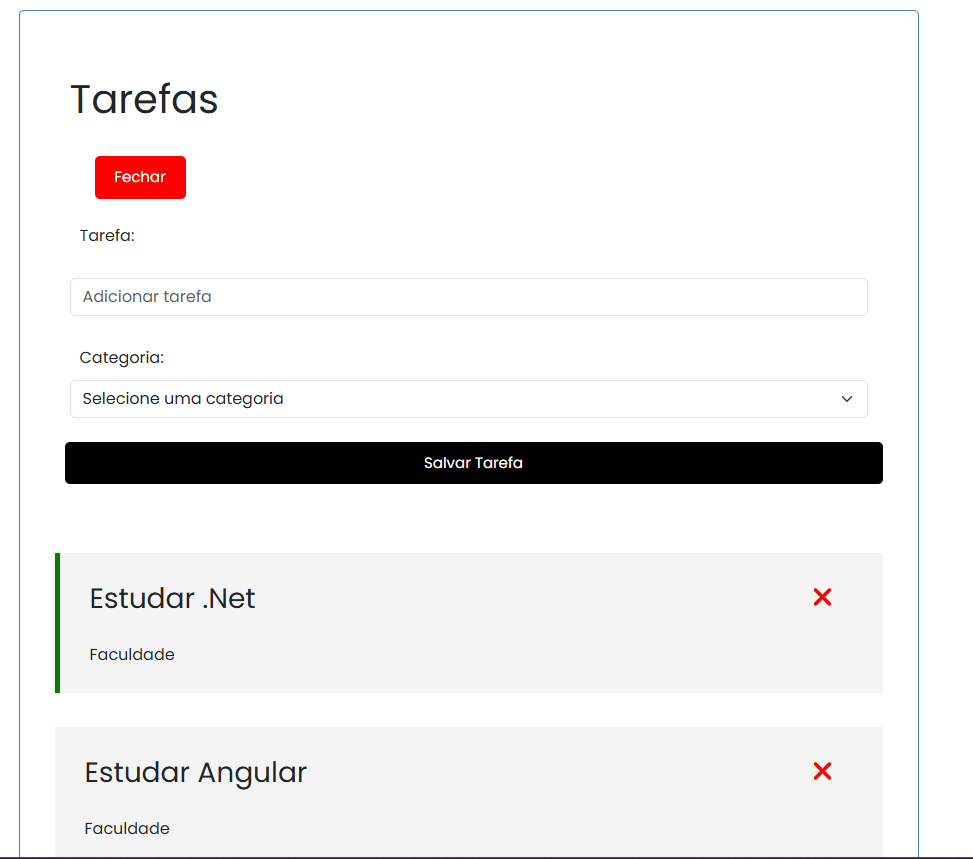

# CRUD Angular

Este projeto é um exemplo de uma aplicação CRUD (Create, Read, Update, Delete) desenvolvida em Angular. Ele demonstra como criar, listar, atualizar e excluir registros em uma interface simples e responsiva.



## Pré-requisitos

Antes de começar, certifique-se de ter o seguinte instalado em sua máquina:

- [Node.js](https://nodejs.org/) (v16 ou superior)
- [Angular CLI](https://angular.io/cli) (v15 ou superior)
- Um editor de código, como [VS Code](https://code.visualstudio.com/)

## Como Executar o Projeto

Siga os passos abaixo para configurar e executar o projeto localmente:

1. **Clone o repositório:**

   ```bash
   git clone https://github.com/WilliamWJD/crud-angular.git
   ```

2. **Navegue até o diretório do projeto:**

   ```bash
   cd crud-angular
   ```

3. **Instale as dependências:**

   ```bash
   npm install
   ```

4. **Execute o servidor de desenvolvimento:**

   ```bash
   ng serve
   ```

5. **Acesse a aplicação:**

   Abra o navegador e acesse [http://localhost:4200](http://localhost:4200). A aplicação será carregada automaticamente.

## Estrutura do Projeto

O projeto está organizado da seguinte forma:

- **`src/app/components/`**: Contém os componentes Angular (ex: listagem, formulário).
- **`src/app/services/`**: Contém os serviços para comunicação com a API ou manipulação de dados.
- **`src/app/models/`**: Contém as interfaces ou classes de modelos de dados.
- **`src/assets/`**: Arquivos estáticos como imagens e estilos globais.

## Funcionalidades

- **Criar**: Adicionar novos registros.
- **Ler**: Listar todos os registros existentes.
- **Atualizar**: Editar registros existentes.
- **Excluir**: Remover registros.

## Tecnologias Utilizadas

- **Angular**: Framework front-end para construção da interface.
- **TypeScript**: Linguagem principal do projeto.
- **HTML/CSS**: Estrutura e estilização da aplicação.
- **RxJS**: Para manipulação de dados assíncronos.

## Contribuição

Contribuições são bem-vindas! Siga os passos abaixo:

1. Faça um fork do projeto.
2. Crie uma branch para sua feature:
   ```bash
   git checkout -b feature/nova-feature
   ```
3. Commit suas alterações:
   ```bash
   git commit -m 'Adiciona nova feature'
   ```
4. Faça push para a branch:
   ```bash
   git push origin feature/nova-feature
   ```
5. Abra um Pull Request.

## Licença

Este projeto está licenciado sob a licença MIT. Consulte o arquivo LICENSE para mais detalhes.

Se precisar de mais alguma coisa, sinta-se à vontade para entrar em contato ou abrir uma issue no repositório! 🚀
